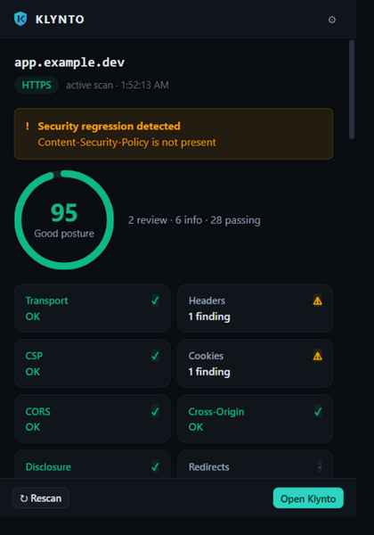
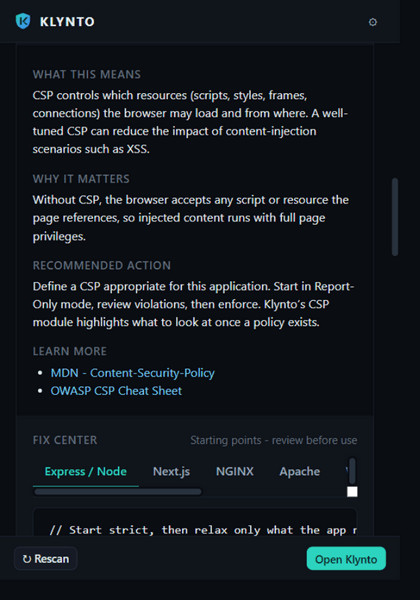
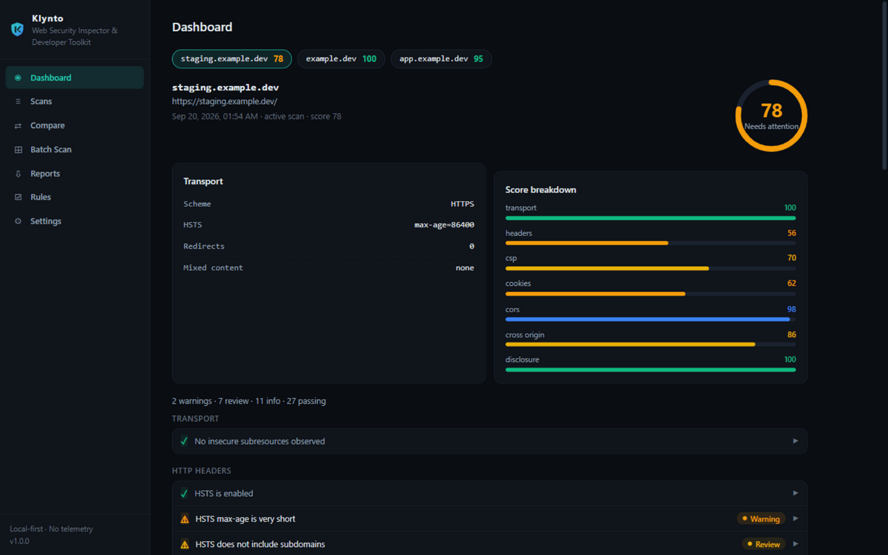
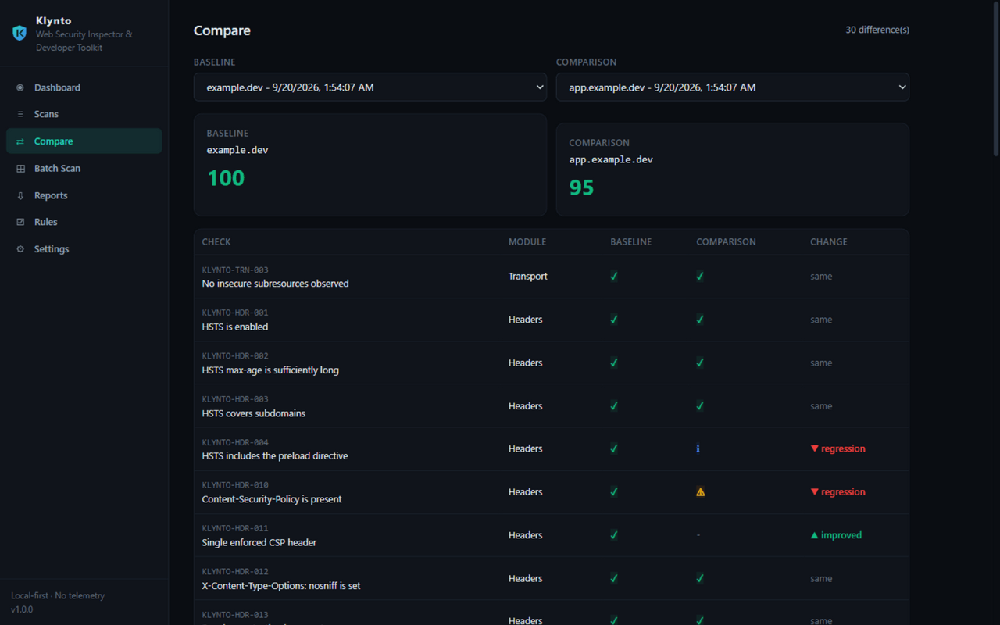
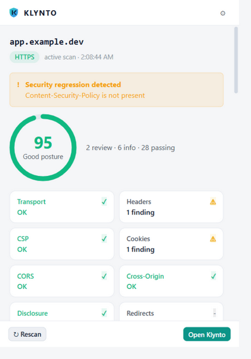
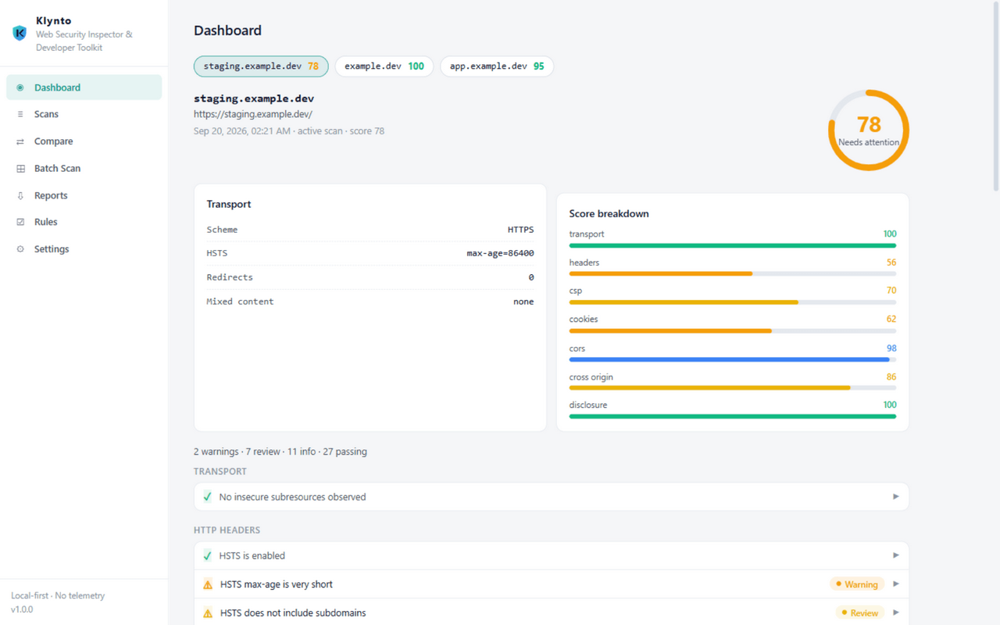

<div align="center">


# Klynto

**Web Security Inspector & Developer Toolkit**

*Inspect. Understand. Fix.*

A local-first browser extension for developers that inspects web security signals,
explains what they mean, identifies configuration issues, and provides actionable fixes.

[](https://github.com/uzairr-arif/KLYNTO/actions/workflows/ci.yml)
[](https://github.com/uzairr-arif/KLYNTO/releases)
[](#development)
[](LICENSE)


**Install:** [Chrome Web Store](https://chromewebstore.google.com/) · [Edge Add-ons](https://microsoftedge.microsoft.com/addons) · [Firefox Add-ons](https://addons.mozilla.org/) *(stores pending review — links land here)*

**Source:** [GitHub](https://github.com/uzairr-arif/KLYNTO) ·
**Documentation:** [Architecture](docs/architecture.md) · [All 60 rules](docs/rules.md) · [Privacy](docs/privacy.md) · [Development](docs/development.md)

</div>

---

## What makes it different

Klynto doesn't just tell you that something exists or is missing. Every finding answers
the three questions that actually matter:

> **What does this mean?** · **Why does it matter?** · **What do I do about it?**

…with copy-paste fixes for your stack (Express, Next.js, NGINX, Apache, WordPress, PHP,
Cloudflare, Django) and links to MDN and OWASP.

## Demo

**Dark theme**

<p align="center">
  
  
</p>
<p align="center">
  
  
</p>

**Light theme**

<p align="center">
  
  
</p>

## Highlights

- **60 security rules across 8 modules** — Transport, HTTP Headers, CSP, Cookies, CORS,
  Cross-Origin Isolation, Information Disclosure, Redirects. Every rule is explained,
  referenced and individually toggleable.
- **Real CSP analysis** — parses directives and flags `unsafe-inline`/`unsafe-eval`,
  wildcard and `data:` sources, missing `object-src`/`base-uri`/`form-action`, invalid
  `'none'` usage and typos that silently disable your policy.
- **Cookie analysis without the cookies API** — reads `Set-Cookie` from observed
  responses: Secure, HttpOnly, SameSite, Domain scope, `__Host-`/`__Secure-` prefixes.
- **Regression detection** — a toolbar badge fires when a control that previously passed
  now fails.
- **Compare mode** — side-by-side diff of any two scans (production vs staging), with
  per-check regression/improvement markers.
- **Batch scanning** — enter a list of targets and scan them all, with a single
  site-access prompt.
- **Reports** — JSON (machines), Markdown (GitHub issues), self-contained HTML
  (print to PDF). CSV for batches.
- **DevTools panel** — full Klynto analysis inside F12, powered by the network log,
  with zero extra permissions.
- **Transparent scoring** — per-module breakdown, no magic. Findings matter more than
  the number.

## Install

### Load unpacked (available now)

The store listings are pending review — the fastest way to run Klynto today is from
source. Works in any Chromium browser (Chrome, Edge, Brave, Opera, Vivaldi):

```bash
git clone https://github.com/uzairr-arif/KLYNTO.git
cd KLYNTO
npm install
npm run build
```

1. Open `chrome://extensions`
2. Enable **Developer mode**
3. Click **Load unpacked** and select the `dist/` folder

`Ctrl+Shift+K` (`Cmd+Shift+K` on macOS) opens Klynto.

### Browser stores (pending review)

Klynto will be published on the Chrome Web Store, Edge Add-ons and Firefox Add-ons.
Badges and direct links land here as each listing goes live.

## Privacy, for real

Klynto is **local-first**: analysis runs entirely in your browser, history stays on
your machine, and nothing is ever sent to a server. There is no telemetry, no account,
no backend.

Permissions are deliberately minimal: no host access at install. Klynto asks **per
site** ("Enable inspection for example.com?"), you can revoke any time in Settings,
and it never modifies requests or pages — it only observes. See the
[privacy documentation](docs/privacy.md).

## How it works

```text
Browser (webRequest · DevTools HAR · fetch)
        │
        ▼
   ScanEvidence  (pure data)
        │
  analyze(evidence)   ← 60-rule engine + scoring
        │
        ▼
   ScanResult ──► Explain · Fix · Report · Compare · Regressions
```

The popup, dashboard and DevTools panel are thin UI over one local rule engine. The
full tour is in [docs/architecture.md](docs/architecture.md).

## Development

```bash
npm install
npm run watch      # rebuild dist/ on change
npm test           # 108 tests — every rule covered
npm run typecheck  # strict TypeScript
npm run lint       # ESLint
npm run release    # build + package store ZIPs into releases/
```

See [docs/development.md](docs/development.md) for the project layout and
[CONTRIBUTING.md](CONTRIBUTING.md) for the contribution checklist (including how to
add a rule).

## Roadmap

- [x] **v0.1** — Foundation: observation, header rules, findings, posture, popup
- [x] **v0.2** — Analysis: CSP, cookies, CORS, transport, disclosure, Fix Center, history, exports
- [x] **v0.3** — Toolkit: compare, regressions, batch, reports, DevTools panel, rule config
- [ ] **v0.4** — Firefox polish (experimental build included; adapter-based architecture)
- [ ] **v0.5** — Custom rules, project environments, security baselines

## Positioning

Klynto helps developers understand the security configuration of the applications
they build. It is **not** a penetration-testing tool and does not replace Burp Suite,
OWASP ZAP or Nmap — and it deliberately avoids crying wolf: legacy headers are
informational, context matters, severities are honest.

## Contributing

Issues and pull requests are welcome — start with
[CONTRIBUTING.md](CONTRIBUTING.md). Security-relevant reports go through
[SECURITY.md](SECURITY.md).

## License

[MIT](LICENSE)
